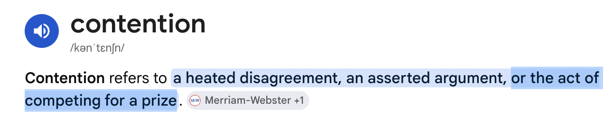

# 🔒 Lock Wars — a multiplayer game that teaches contention



Everyone is a **worker**. Each job's key maps (by hash) to one of **N shared locks**. To
process a job you must grab the lock it needs, do the work (a few clicks = the critical
section), then release it. Only one person can hold a given lock at a time — **everyone
else who needs that lock has to wait.** That waiting is contention, and the end screen
quantifies exactly how much time the team burned blocking.

## The teaching dial: number of locks (shards)

In the lobby the host sets **number of locks (shards)**:

- **1 lock** → one global lock, everyone fights for it = maximum contention (the default).
- **2–8 locks** → jobs spread across locks by hash, so fewer workers collide.

Play one round with the same crew at **1 lock**, then again at **4 locks**, and compare the
end screens. In a 4-player test: 1 lock produced 44 jobs with 40s blocked; 4 locks produced
**103 jobs with only 13s blocked** — same people, one knob, ~2.3× the throughput and ~3× less
waiting. That's **lock striping** — exactly how `ConcurrentHashMap` locks buckets instead of
the whole map. (It stops helping when work doesn't spread evenly — a "hot key.")

## Run it (host machine, needs Node.js 18+)

```bash
npm install
npm start
```

The server prints a `localhost` URL and a LAN URL like `http://192.168.x.x:3000`.

## How your juniors join

Make sure everyone is on the **same Wi-Fi**, then share the LAN URL. Each person opens it
on their own laptop or phone, types a name, and joins. **The first person to join is the
host** and gets the Start button + settings.

## How to play (≈1–2 minutes per round)

1. Host picks *work per job* (clicks in the critical section) and *round length*, then **Start**.
2. Tap **GRAB THE LOCK**. If it's free, you get it; if not, you're **BLOCKED** in a FIFO queue.
3. While holding, mash **WORK** until the job is done — the lock auto-releases to the next waiter.
4. Watch the live throughput chart and the "workers blocked right now" meter.
5. End screen shows the leaderboard + total worker-seconds wasted blocking.

## What it's meant to teach

- **Mutual exclusion**: only one worker is ever in the critical section.
- **Blocking / head-of-line stalls**: a slow holder (high *work per job*, or someone idle until the timeout) stalls *everyone*.
- **Throughput collapse**: doubling the workers does NOT double output — the single lock serializes them.
- **The fixes**: run rounds and discuss sharding the lock, shrinking the critical section, or going lock-free.

### Knobs to demonstrate ideas
- Raise **work per job** → longer critical section → waiting explodes (contention cost up).
- Add **more players** → throughput barely moves, blocked time skyrockets.

## Files
- `server.js` — authoritative lock, FIFO queue, round timer, stats (Node + `ws`).
- `client.html` — the whole UI, served by the server.
- `package.json` — one dependency (`ws`).
